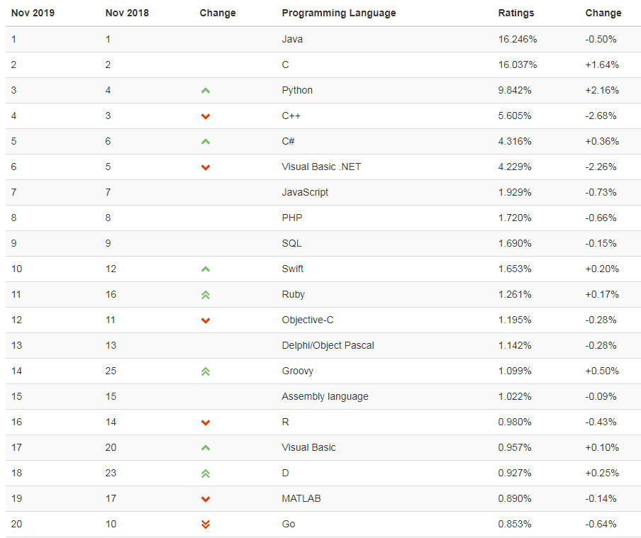
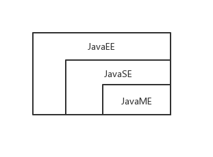
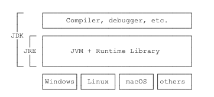
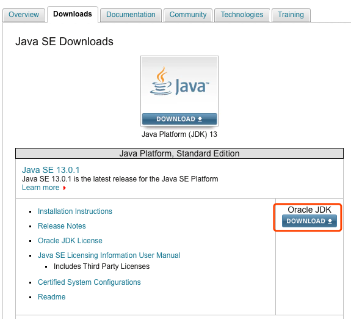
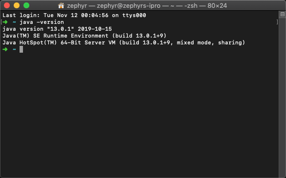

# 1. java 初窥
Java最早是由SUN公司（现已被Oracle收购）在上个世纪90年代初开发的一门编程语言，在1995年正式命名为Java。起初的名字是Oak，目标是小型家电设备的嵌入式应用，但是没有多大反响，却因为互联网的崛起，导致Java重新焕发生机，成为最重要的网络编程语言。

## 1.1 java前景
Java 语言在世界编程语言使用率上多年来一直处于前三的地位，重要性不言而喻，在2019年10月的排名数据中，java位居榜首, 学习java语言可以拥有较好的前景是毋庸置疑的：



- **java是世界上最受欢迎的编程语言**：java从出现到现在已经发展了28年，这28年里，产生了无数和java有关的产品、技术和标准，拥有众多的开源框架和组建用于快速构建大型企业应用项目。
- **企业最热衷的编程语言**：因为java易学、安全性、可移植、跨平台等特点，并且提供了大量开源框架和组建，易于构建大型企业应用项目。
- **学习java高薪没有问题**：现在市场需要大量的java开发人员，但是人员质量参差不齐，且大市场上供不应求，很多企业愿意给由计算机专业的大专以上学生以高薪（当然，前提是有过硬的技术能力）。话不多说，直接上图：


## 1.2 java特性简述
java 有很多的特性，比如简单、面向对象、分布式、健壮性、安全性等。

### 这里解释一下跨平台特性

Java 是一个解释型和编译型之间的语言，编译型语言的代表如C/C++，将代码编译成机器码执行，但是不同的CPU指令集不同，导致在不同的平台需要编译出对应的机器码。而解释型语言可以直接加载源码直接运行，代价是运行效率太低。

Java将代码编译成一种"字节码"，类似于在CPU和代码中间做了一个适配器，而这个适配器就是Java虚拟机（JVM），不同平台的运行不同的虚拟机负责加载字节码执行，这样实现了代码一次编写，处处执行。SUN公司制定了一系列的java虚拟机规范，成为了java虚拟机高兼容性的保证。

### Java版本

Java有三个不同的版本：

- Java SE：Standard Edition，java标准版，包含标准的jvm和标准库。
- Java EE：Enterprise Edition，java企业版，为方便开发web应用、数据、消息服务等，在Java SE基础上加了大量的API和库。
- Java ME：Micro Edition，是一个针对嵌入式设备瘦身版。
三者的关系如下：



毫无疑问，Java SE是核心，但是学习Web开发，Java EE是必须学习的。

## 1.3 相关名词解释
初学Java 常常听见JDK、JRE等名词，他们到底是什么呢？
- JRE：Java Runtime Environment java字节码的虚拟机。
- JDK：Java Development Kit 将java源码编译成java字节码需要jdk，提供编译器、调试器等开发工具。
如下图：



## 1.4 相关工具推荐

### 书籍推荐：
- 《java核心技术》（卷一、卷二）
- 《Thinking in Java》
- 《Java核心思想》
- 《Effective Java》
- 《深入理解Java虚拟机》
- 《Java并发编程》
书籍关注公众号，后台发送"书籍"，可获取书籍下载链接。

### 工具
- 编译器推荐使用 Jetbrains IDEA（[工具注册码免费获取](http://idea.medeming.com/）)

## 1.5 java环境配置
Java程序必须运行在JVM之上，所以我们第一件事应该安装JDK。

打开[Oracle官网](https://www.oracle.com/technetwork/java/javase/downloads/index.html)并点击下载JDK13:



下载完成后直接安装即可（windows 建议将默认的安装目录中的Program Files 改为Java或自定义文件夹，因为安装目录有空格后续会导致一些莫名其妙的问题）。

### 设置环境变量
#### windows配置环境变量：
找到JDK的安装路径，默认的路径为：
```
C:\Program Files\Java\jdk-13
```
可右键我的电脑->属性->环境变量设置->新建，在弹出框中变量名填写`JAVA_HOME`，变量值填写上述jdk安装路径。

继续新建，变量名填写`CLASSPATH`,变量值填写`.;%JAVA_HOME%\lib\dt.jar;%JAVA_HOME%\lib\tools.jar;`

### MAC配置环境变量
在mac下，在`～/.bash_profile`里面：
```
export JAVA_HOME=`/usr/libexec/java_home -v 13`
```
并且将`JAVA_HOME`添加到path，在`~/.bash_profile`中添加：
```
export PATH=$JAVA_HOME/bin:$PATH
```

### 安装成功
在命令行输入`java -version`，显示版本信息则安装成功。



### JDK
在JAVA_HOME 的bin下找到很多可执行文件：
- java：这个可执行程序其实就是JVM，运行Java程序，就是启动JVM，然后让JVM执行指定的编译后的代码；
- javac：这是Java的编译器，它用于把Java源码文件（以.java后缀结尾）编译为Java字节码文件（以.class后缀结尾）；
- jar：用于把一组.class文件打包成一个.jar文件，便于发布；
- javadoc：用于从Java源码中自动提取注释并生成文档；
- jdb：Java调试器，用于开发阶段的运行调试。